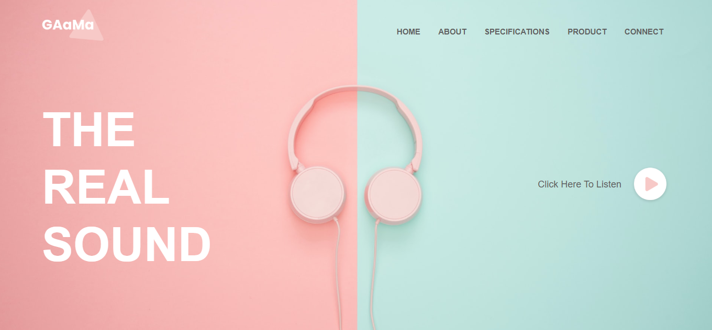

# 🎧 Gaama – The Real Sound

This prject entails clean and modern music-themed landing page example built with **HTML** and **CSS**. This project features a two-column layout with soft pastel colors, an engaging call-to-action, and an aesthetic headphone theme aimed at promoting music products or platforms.


## 📁 Project Structure

```
├── index.html             # Main HTML file
├── style.css              # Stylesheet file
├── images/
│   ├── logo.png           # Website logo
│   ├── image.png          # Background image (split pink & teal)
│   └── play.png           # Play button icon
├── Screenshot 2025-07-16 165353.png  # README preview image
```


## ✨ Features

* 🎨 Split-screen background with pink & mint hues
* 🎧 Centralized headphone-themed layout
* 🧭 Navigation bar with hover underline effects
* 📣 Bold text: “THE REAL SOUND”
* 🔘 Interactive play button section (visually styled)


## 📦 Built With

* HTML5
* CSS3 (Flexbox for layout)
* Custom styling with background images and hover effects


## 🚀 Getting Started

To run this project locally:

```bash
# Clone this repository
git clone https://github.com/Ogola-Maxwell-Ochieng/Gaama-Music.git

# Open in browser
open index.html  # or just double-click it
```


## 💡 Customization

You can:

* Replace `images/image.png` to use a different background.
* Update the heading text or add additional sections.
* Connect the play button to a real audio file or music platform using JavaScript.


## 📸 Screenshot



## 📌 Future Enhancements

* Integrate background music/audio player
* Add animations to the play button
* Make fully responsive for mobile view
* Include product feature sections


## 📃 License

This project is open for personal or educational use. Attribution is appreciated.